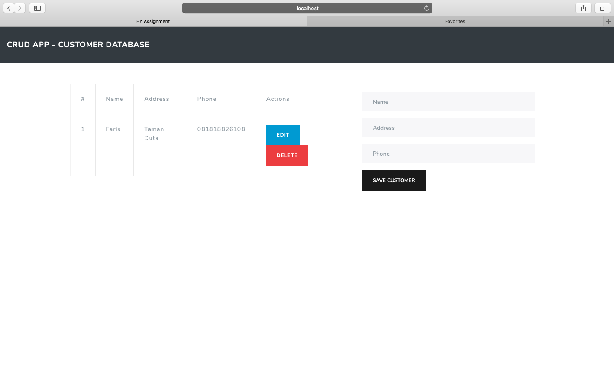
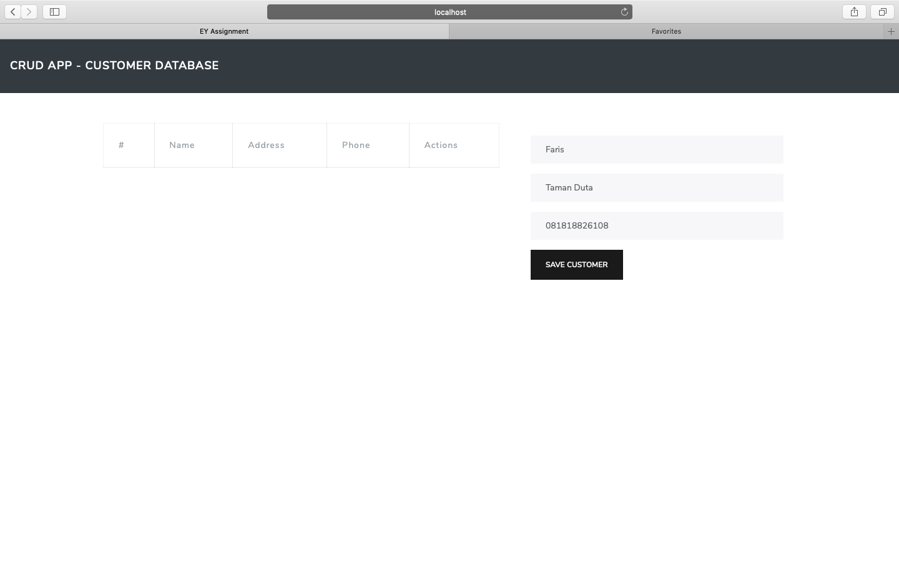

# CRUD App - Customer Database

Run this project by this command :

1. `npm install`
2. `nodemon src/index.js`
(Please install nodemon and express first using npm install -g nodemon express)
3. `localhost:3000`

nb. Check mysql password in your laptop and match them with the one in index.js

#### Screenshot

Home Page

Add New Customer

